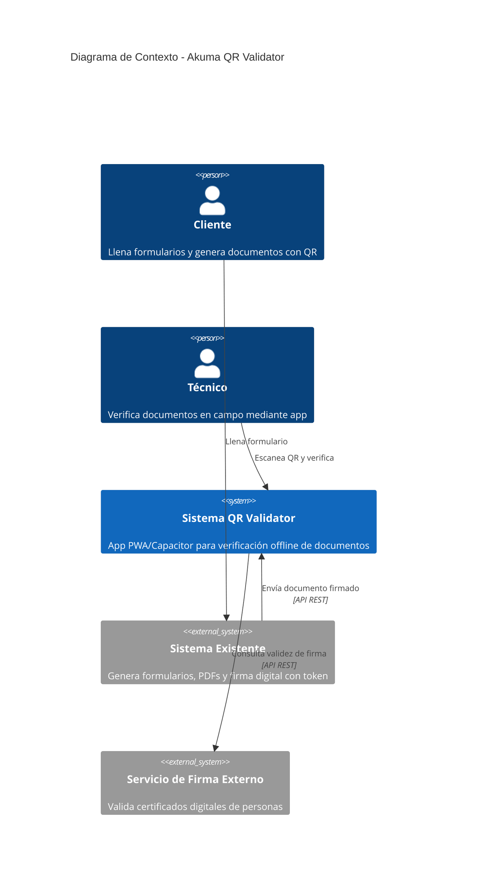
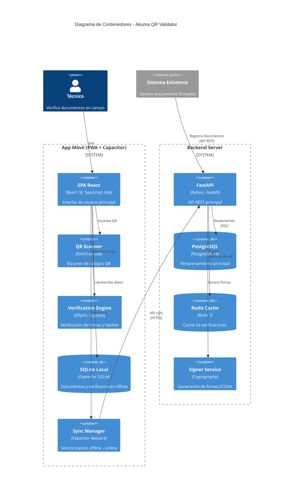
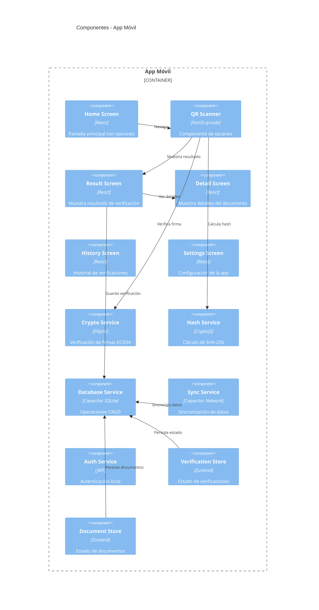
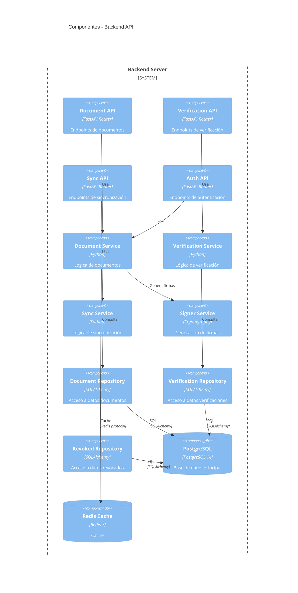
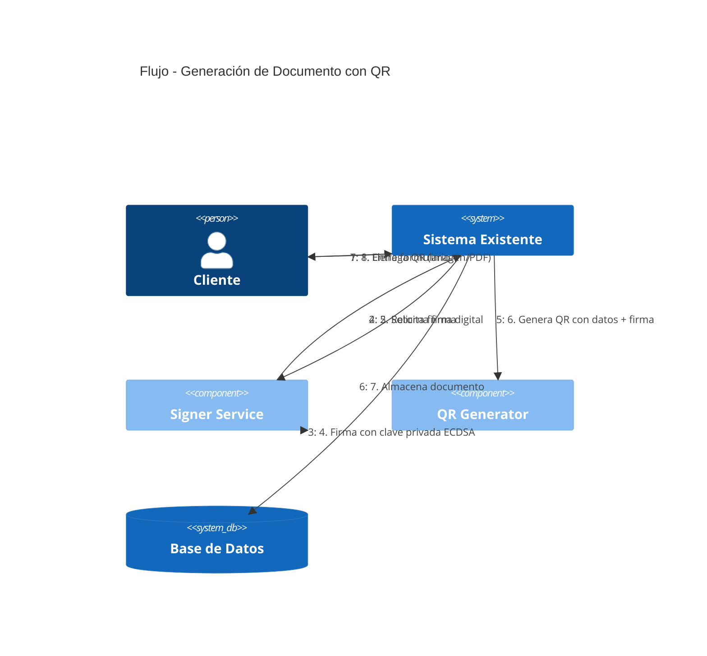
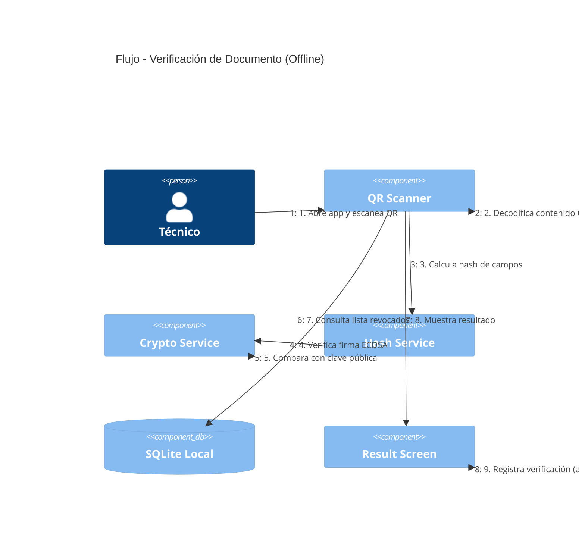
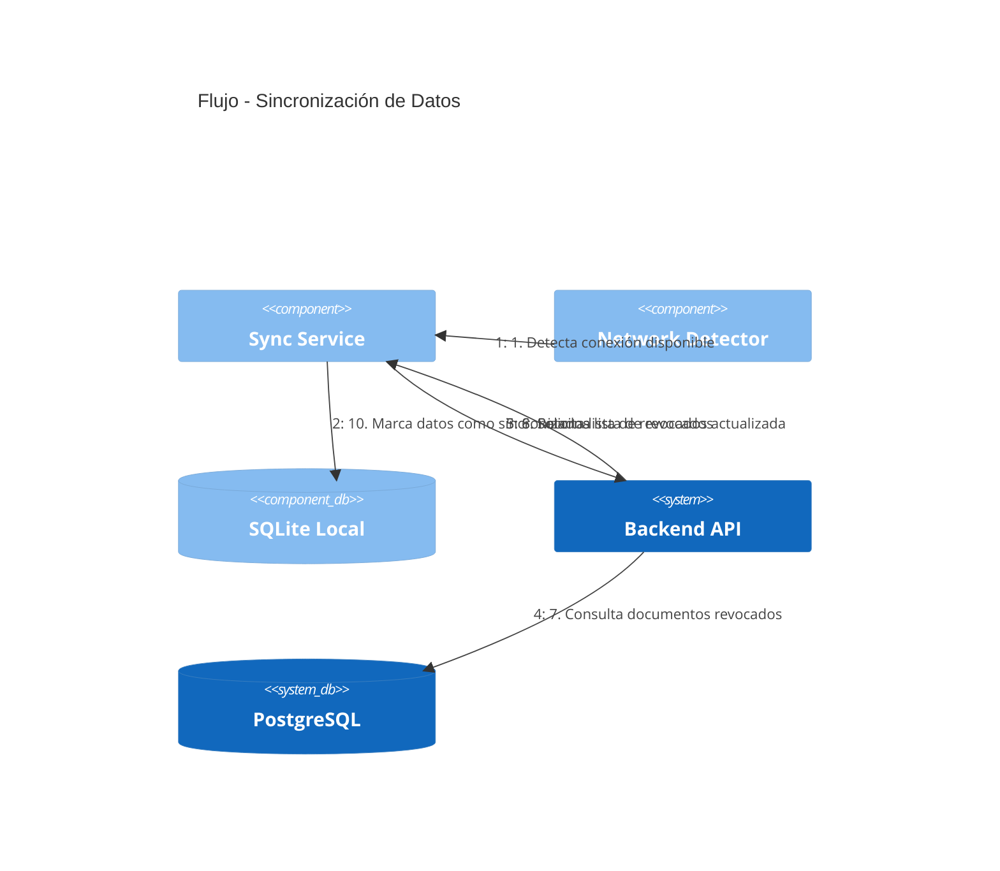
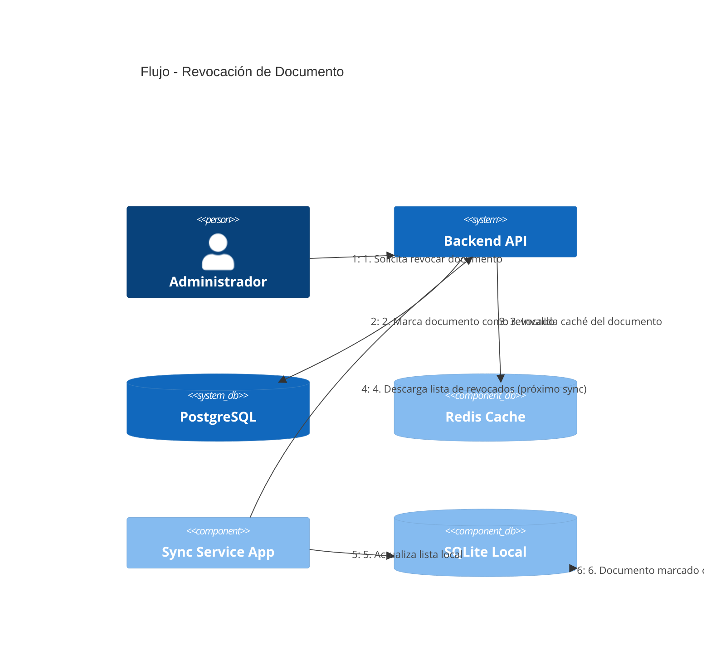
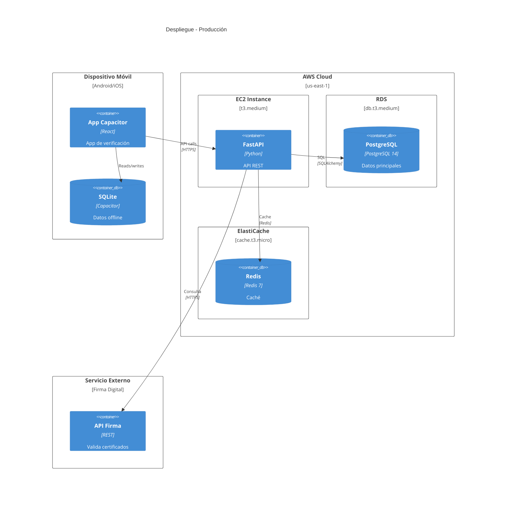

# Arquitectura de Software - Sistema de Validación de Documentos con QR

## 1. Identificación del Sistema

| Campo | Descripción |
|-------|-------------|
| **Nombre** | Akuma QR Validator |
| **Versión** | 1.0.0 |
| **Fecha** | Julio 2024 |
| **Objetivo** | Validar documentos mediante códigos QR en áreas con conectividad limitada |

---

## 2. Requisitos Funcionales

### 2.1 Módulo de Generación de Documentos

| ID | Requisito | Prioridad |
|----|-----------|-----------|
| RF-001 | El sistema generará un código QR único por cada transacción registrada | Alta |
| RF-002 | El QR contendrá: ID transacción, datos del cliente, fecha, campaña, ubicación, hash y firma digital | Alta |
| RF-003 | El QR será firmado digitalmente con clave privada ECDSA (secp256r1) | Alta |
| RF-004 | El sistema generará el QR con logo de empresa (nivel corrección H - 30%) | Media |
| RF-005 | El cliente podrá descargar el QR como imagen o dentro del PDF del reporte | Alta |
| RF-006 | El QR será único e irrepetible por transacción | Alta |

### 2.2 Módulo de Verificación

| ID | Requisito | Prioridad |
|----|-----------|-----------|
| RF-010 | La app permitirá escanear códigos QR mediante la cámara del dispositivo | Alta |
| RF-011 | La app verificará la firma digital del QR con clave pública embebida | Alta |
| RF-012 | La app verificará que el documento existe en la base de datos local | Alta |
| RF-013 | La app verificará que el documento no esté en la lista de revocados | Alta |
| RF-014 | La app mostrará resultado: VÁLIDO / INVÁLIDO / REVOCADO | Alta |
| RF-015 | La app mostrará campos clave del documento después de verificar | Alta |
| RF-016 | El técnico podrá ver el reporte completo (PDF) solo con conexión a internet | Media |
| RF-017 | La verificación funcionará 100% offline | Alta |
| RF-018 | El tiempo de verificación será menor a 3 segundos | Alta |

### 2.3 Módulo de Auditoría

| ID | Requisito | Prioridad |
|----|-----------|-----------|
| RF-020 | Cada verificación registrará: técnico, fecha/hora, GPS (si disponible), resultado | Alta |
| RF-021 | Las verificaciones se almacenarán en SQLite local | Alta |
| RF-022 | Las verificaciones se sincronizarán con el servidor cuando haya internet | Alta |
| RF-023 | Se podrá consultar historial de verificaciones por técnico | Media |
| RF-024 | Se podrá consultar historial de verificaciones por transacción | Media |

### 2.4 Módulo de Sincronización

| ID | Requisito | Prioridad |
|----|-----------|-----------|
| RF-030 | La app sincronizará documentos recibidos cuando haya internet | Alta |
| RF-031 | La app sincronizará verificaciones pendientes cuando haya internet | Alta |
| RF-032 | La app descargará lista actualizada de documentos revocados | Alta |
| RF-033 | La sincronización será automática al detectar conexión | Media |
| RF-034 | La app manejará colisiones de datos (mismo documento modificado offline) | Media |

### 2.5 Módulo de Gestión de Dispositivos

| ID | Requisito | Prioridad |
|----|-----------|-----------|
| RF-040 | Cada dispositivo tendrá un ID único registrado | Alta |
| RF-041 | El técnico iniciará sesión con credenciales en el dispositivo | Alta |
| RF-042 | Se podrá revocar acceso de un dispositivo | Media |
| RF-043 | Se mantendrá sesión activa localmente (sin re-login constante) | Alta |

---

## 3. Requisitos No Funcionales

### 3.1 Rendimiento

| ID | Requisito | Métrica |
|----|-----------|---------|
| RNF-001 | Tiempo de verificación offline | < 3 segundos |
| RNF-002 | Tiempo de escaneo QR | < 2 segundos |
| RNF-003 | Tiempo de carga de app inicial | < 5 segundos |
| RNF-004 | Tamaño máximo de la app | < 50 MB |
| RNF-005 | Uso máximo de memoria RAM | < 200 MB |
| RNF-006 | Capacidad de verificaciones simultáneas (servidor) | 500 usuarios |

### 3.2 Disponibilidad

| ID | Requisito | Métrica |
|----|-----------|---------|
| RNF-010 | Disponibilidad de la app offline | 100% (sin dependencia de servidor) |
| RNF-011 | Disponibilidad del servidor backend | 99.5% |
| RNF-012 | Tiempo máximo de downtime planificado | 4 horas/mes |
| RNF-013 | Backup automático de base de datos | Diario |

### 3.3 Seguridad

| ID | Requisito | Descripción |
|----|-----------|-------------|
| RNF-020 | Firma digital ECDSA | Clave privada solo en servidor |
| RNF-021 | Hash SHA-256 | Integridad de datos del QR |
| RNF-022 | Clave pública embebida | Solo verificación en app |
| RNF-023 | Almacenamiento seguro de claves | Key Vault o HSM |
| RNF-024 | Comunicación HTTPS | TLS 1.2+ obligatorio |
| RNF-025 | Autenticación JWT | Tokens con expiración |
| RNF-026 | Ofuscación de código | Protección contra reverse engineering |
| RNF-027 | Detección de dispositivo rooteado | Bloqueo de app en dispositivos comprometidos |

### 3.4 Compatibilidad

| ID | Requisito | Plataformas |
|----|-----------|-------------|
| RNF-030 | Sistema operativo mínimo | Android 8.0+, iOS 15+ |
| RNF-031 | Navegadores web | Chrome 90+, Safari 15+, Firefox 90+ |
| RNF-032 | Resolución mínima | 360x640 px |
| RNF-033 | Cámaras | Resolución mínima 5MP |

### 3.5 Mantenibilidad

| ID | Requisito | Descripción |
|----|-----------|-------------|
| RNF-040 | Cobertura de tests | Mínimo 80% |
| RNF-041 | Documentación de código | JSDoc/docstrings en funciones públicas |
| RNF-042 | Logs estructurados | JSON con timestamp y nivel |
| RNF-043 | Monitoreo de errores | Integración con Sentry o similar |

### 3.6 Usabilidad

| ID | Requisito | Descripción |
|----|-----------|-------------|
| RNF-050 | Interfaz intuitiva | Máximo 3 pasos para verificar |
| RNF-051 | Feedback visual | Colores verde/rojo para resultados |
| RNF-052 | Accesibilidad | Contraste WCAG 2.1 AA |
| RNF-053 | Modo oscuro | Soporte opcional |

---

## 4. Stack Tecnológico

### 4.1 Frontend - App Móvil (PWA + Capacitor)

```
┌─────────────────────────────────────────────────────────────────┐
│                      FRONTEND APP                               │
├─────────────────────────────────────────────────────────────────┤
│  Framework:        React 18 + TypeScript                        │
│  Bundler:          Vite 5                                       │
│  State Management: Zustand + Zustand Persist                    │
│  UI Components:    Tailwind CSS + Headless UI                   │
│  Routing:          React Router 6                               │
│  Capacitor:        v5 (wrapper nativo)                          │
├─────────────────────────────────────────────────────────────────┤
│  LIBRERÍAS ESPECÍFICAS:                                        │
│  ├── @capacitor-community/sqlite  (SQLite nativo)              │
│  ├── @capacitor/camera            (Escaneo QR)                 │
│  ├── @capacitor/geolocation       (GPS para auditoría)         │
│  ├── @capacitor/network           (Detectar conectividad)      │
│  ├── @capacitor/filesystem        (Lectura de archivos)        │
│  ├── html5-qrcode                 (Escáner QR en cámara)       │
│  ├── elliptic                     (Verificación ECDSA)         │
│  ├── crypto-js                    (Hash SHA-256)               │
│  └── qrcode                       (Generación QR con logo)     │
└─────────────────────────────────────────────────────────────────┘
```

### 4.2 Backend - API Server

```
┌─────────────────────────────────────────────────────────────────┐
│                       BACKEND API                               │
├─────────────────────────────────────────────────────────────────┤
│  Lenguaje:        Python 3.10+                                 │
│  Framework:       FastAPI 0.104+                                │
│  ORM:             SQLAlchemy 2.0                                │
│  Migraciones:     Alembic                                       │
│  Validación:      Pydantic 2.0                                  │
│  Servidor ASGI:   Uvicorn                                       │
├─────────────────────────────────────────────────────────────────┤
│  BASE DE DATOS:                                                 │
│  ├── PostgreSQL 14+     (datos principales)                    │
│  └── Redis 7+           (caché de verificaciones)              │
├─────────────────────────────────────────────────────────────────┤
│  SEGURIDAD:                                                     │
│  ├── python-jose        (JWT tokens)                           │
│  ├── cryptography       (Firma ECDSA)                          │
│  └── passlib            (Hash de contraseñas)                  │
├─────────────────────────────────────────────────────────────────┤
│  UTILIDADES:                                                    │
│  ├── qrcode[pil]        (Generación QR)                        │
│  ├── Pillow             (Procesamiento de imágenes)            │
│  └── httpx              (Cliente HTTP async)                   │
└─────────────────────────────────────────────────────────────────┘
```

### 4.3 Infraestructura

```
┌─────────────────────────────────────────────────────────────────┐
│                      INFRAESTRUCTURA                            │
├─────────────────────────────────────────────────────────────────┤
│  SERVIDOR:                                                      │
│  ├── AWS EC2 / Azure VM / On-premise                           │
│  ├── Mínimo: 2 vCPU, 4GB RAM, 50GB SSD                        │
│  └── SO: Ubuntu 22.04 LTS                                      │
│                                                                 │
│  CONTENEDORES (Opcional):                                       │
│  ├── Docker 24+                                                 │
│  └── Docker Compose                                             │
│                                                                 │
│  CI/CD:                                                         │
│  ├── GitHub Actions / GitLab CI                                 │
│  └── Build automático APK/IPA                                   │
│                                                                 │
│  MONITOREO:                                                     │
│  ├── Prometheus + Grafana (métricas)                           │
│  └── Sentry (errores de app)                                   │
└─────────────────────────────────────────────────────────────────┘
```

### 4.4 Herramientas de Desarrollo

| Categoría | Herramienta | Versión |
|-----------|-------------|---------|
| IDE | VS Code | Latest |
| Control versiones | Git | 2.40+ |
| Repositorio | GitHub / GitLab | - |
| Diseño UI | Figma | Latest |
| API Testing | Postman / Insomnia | Latest |
| DB Admin | pgAdmin / DBeaver | Latest |
| Android Build | Android Studio | 2023+ |
| iOS Build | Xcode | 15+ (Mac) |

---

## 5. Arquitectura del Sistema

### 5.1 Diagrama de Contexto (C4 Nivel 1)



### 5.2 Diagrama de Contenedores (C4 Nivel 2)



### 5.3 Diagrama de Componentes (C4 Nivel 3) - App



### 5.4 Diagrama de Componentes (C4 Nivel 3) - Backend



---

## 6. Flujo del Proceso

### 6.1 Flujo Principal - Generación de Documento



### 6.2 Flujo Principal - Verificación de Documento



### 6.3 Flujo de Sincronización Offline→Online



### 6.4 Flujo de Revocación de Documento



---

## 7. Estructura de Módulos

### 7.1 Frontend - App Móvil

```
app/
├── src/
│   ├── components/                    # Componentes reutilizables
│   │   ├── common/                    # Componentes genéricos
│   │   │   ├── Button.tsx
│   │   │   ├── Card.tsx
│   │   │   ├── Modal.tsx
│   │   │   └── Loading.tsx
│   │   ├── qr/                        # Componentes QR
│   │   │   ├── QRScanner.tsx
│   │   │   ├── QRDisplay.tsx
│   │   │   └── QRGenerator.tsx
│   │   ├── verification/              # Componentes verificación
│   │   │   ├── VerificationResult.tsx
│   │   │   ├── VerificationDetails.tsx
│   │   │   └── VerificationHistory.tsx
│   │   └── layout/                    # Layouts
│   │       ├── Header.tsx
│   │       └── Navigation.tsx
│   │
│   ├── screens/                       # Pantallas
│   │   ├── HomeScreen.tsx
│   │   ├── ScanScreen.tsx
│   │   ├── ResultScreen.tsx
│   │   ├── DetailScreen.tsx
│   │   ├── HistoryScreen.tsx
│   │   ├── SettingsScreen.tsx
│   │   └── LoginScreen.tsx
│   │
│   ├── services/                      # Servicios
│   │   ├── crypto/                    # Criptografía
│   │   │   ├── signature.ts          # Verificación ECDSA
│   │   │   └── hash.ts               # Cálculo SHA-256
│   │   ├── database/                  # Base de datos local
│   │   │   ├── sqlite.ts             # Conexión SQLite
│   │   │   ├── documents.ts          # CRUD documentos
│   │   │   ├── verifications.ts      # CRUD verificaciones
│   │   │   └── revoked.ts            # Lista revocados
│   │   ├── sync/                      # Sincronización
│   │   │   ├── syncManager.ts        # Gestor principal
│   │   │   ├── documentSync.ts       # Sync documentos
│   │   │   └── verificationSync.ts   # Sync verificaciones
│   │   ├── auth/                      # Autenticación
│   │   │   ├── authService.ts
│   │   │   └── tokenManager.ts
│   │   └── network/                   # Red
│   │       └── networkDetector.ts
│   │
│   ├── stores/                        # Estado global
│   │   ├── useDocumentStore.ts
│   │   ├── useVerificationStore.ts
│   │   └── useSettingsStore.ts
│   │
│   ├── utils/                         # Utilidades
│   │   ├── constants.ts              # Constantes
│   │   ├── helpers.ts                # Funciones auxiliares
│   │   └── formatters.ts            # Formateo de datos
│   │
│   ├── types/                         # Tipos TypeScript
│   │   ├── document.ts
│   │   ├── verification.ts
│   │   └── api.ts
│   │
│   ├── hooks/                         # Custom hooks
│   │   ├── useQRScanner.ts
│   │   ├── useVerification.ts
│   │   └── useSync.ts
│   │
│   ├── App.tsx                        # Componente principal
│   ├── main.tsx                       # Entry point
│   └── routes.tsx                     # Rutas
│
├── android/                           # Capacitor Android
├── ios/                               # Capacitor iOS
├── public/                            # Assets estáticos
│   ├── keys/                          # Claves públicas
│   │   └── public_key.pem
│   └── images/
│       └── logo.png
├── capacitor.config.ts                # Configuración Capacitor
├── vite.config.ts                     # Configuración Vite
├── tailwind.config.js                 # Configuración Tailwind
├── tsconfig.json                      # Configuración TypeScript
└── package.json                       # Dependencias
```

### 7.2 Backend - API Server

```
server/
├── app/
│   ├── api/                           # Endpoints
│   │   ├── __init__.py
│   │   ├── deps.py                    # Dependencias
│   │   ├── routes/
│   │   │   ├── __init__.py
│   │   │   ├── documents.py          # /api/documents
│   │   │   ├── verifications.py      # /api/verifications
│   │   │   ├── sync.py               # /api/sync
│   │   │   ├── auth.py               # /api/auth
│   │   │   └── health.py             # /api/health
│   │   └── middleware/
│   │       ├── auth.py               # JWT middleware
│   │       └── rateLimit.py          # Rate limiting
│   │
│   ├── core/                          # Núcleo
│   │   ├── __init__.py
│   │   ├── config.py                  # Configuración
│   │   ├── security.py               # Seguridad
│   │   └── keys.py                    # Manejo de claves
│   │
│   ├── models/                        # Modelos
│   │   ├── __init__.py
│   │   ├── database.py               # Conexión DB
│   │   ├── document.py               # Modelo documento
│   │   ├── verification.py           # Modelo verificación
│   │   ├── revoked.py                # Modelo revocado
│   │   └── user.py                   # Modelo usuario
│   │
│   ├── schemas/                       # Schemas Pydantic
│   │   ├── __init__.py
│   │   ├── document.py
│   │   ├── verification.py
│   │   └── auth.py
│   │
│   ├── services/                      # Servicios
│   │   ├── __init__.py
│   │   ├── document_service.py
│   │   ├── verification_service.py
│   │   ├── sync_service.py
│   │   └── signer_service.py
│   │
│   ├── repositories/                  # Repositorios
│   │   ├── __init__.py
│   │   ├── document_repo.py
│   │   ├── verification_repo.py
│   │   └── revoked_repo.py
│   │
│   └── main.py                        # Entry point
│
├── migrations/                        # Alembic
│   ├── versions/
│   └── env.py
│
├── tests/                             # Tests
│   ├── unit/
│   ├── integration/
│   └── e2e/
│
├── scripts/                           # Scripts útiles
│   ├── generate_keys.py              # Generar claves
│   └── seed_data.py                  # Datos de prueba
│
├── requirements.txt                   # Dependencias Python
├── Dockerfile                         # Docker
├── docker-compose.yml                 # Docker Compose
├── alembic.ini                        # Configuración Alembic
└── .env.example                       # Variables de entorno
```

---

## 8. Modelo de Base de Datos

### 8.1 PostgreSQL (Servidor)

```sql
-- Tabla de documentos
CREATE TABLE documents (
    id VARCHAR(50) PRIMARY KEY,
    client_name VARCHAR(200) NOT NULL,
    transaction_date DATE NOT NULL,
    campaign VARCHAR(100),
    location VARCHAR(200),
    form_data JSONB NOT NULL,
    hash_document VARCHAR(64) NOT NULL,
    signature TEXT NOT NULL,
    created_at TIMESTAMP DEFAULT CURRENT_TIMESTAMP,
    updated_at TIMESTAMP DEFAULT CURRENT_TIMESTAMP,
    status VARCHAR(20) DEFAULT 'active'
);

-- Tabla de verificaciones
CREATE TABLE verifications (
    id SERIAL PRIMARY KEY,
    document_id VARCHAR(50) REFERENCES documents(id),
    technician_id VARCHAR(50) NOT NULL,
    technician_name VARCHAR(200) NOT NULL,
    device_id VARCHAR(100),
    verification_date TIMESTAMP DEFAULT CURRENT_TIMESTAMP,
    latitude DECIMAL(10, 8),
    longitude DECIMAL(11, 8),
    result VARCHAR(20) NOT NULL,
    synced BOOLEAN DEFAULT FALSE
);

-- Tabla de documentos revocados
CREATE TABLE revoked_documents (
    document_id VARCHAR(50) PRIMARY KEY REFERENCES documents(id),
    revoked_at TIMESTAMP DEFAULT CURRENT_TIMESTAMP,
    reason TEXT,
    revoked_by VARCHAR(50)
);

-- Tabla de usuarios/técnicos
CREATE TABLE users (
    id VARCHAR(50) PRIMARY KEY,
    name VARCHAR(200) NOT NULL,
    email VARCHAR(200) UNIQUE NOT NULL,
    password_hash VARCHAR(200) NOT NULL,
    role VARCHAR(20) DEFAULT 'technician',
    active BOOLEAN DEFAULT TRUE,
    created_at TIMESTAMP DEFAULT CURRENT_TIMESTAMP
);

-- Tabla de dispositivos
CREATE TABLE devices (
    id VARCHAR(100) PRIMARY KEY,
    user_id VARCHAR(50) REFERENCES users(id),
    name VARCHAR(200),
    platform VARCHAR(20),
    last_sync TIMESTAMP,
    active BOOLEAN DEFAULT TRUE
);
```

### 8.2 SQLite (Local - App)

```sql
-- Tabla de documentos locales
CREATE TABLE local_documents (
    id VARCHAR(50) PRIMARY KEY,
    client_name VARCHAR(200),
    transaction_date TEXT,
    campaign VARCHAR(100),
    location VARCHAR(200),
    form_data TEXT,
    hash_document VARCHAR(64),
    signature TEXT,
    created_at INTEGER,
    synced INTEGER DEFAULT 0
);

-- Tabla de verificaciones locales
CREATE TABLE local_verifications (
    id INTEGER PRIMARY KEY AUTOINCREMENT,
    document_id VARCHAR(50),
    technician_id VARCHAR(50),
    technician_name VARCHAR(200),
    device_id VARCHAR(100),
    verification_date INTEGER,
    latitude REAL,
    longitude REAL,
    result VARCHAR(20),
    synced INTEGER DEFAULT 0
);

-- Tabla de documentos revocados locales
CREATE TABLE local_revoked (
    document_id VARCHAR(50) PRIMARY KEY,
    revoked_at INTEGER,
    reason TEXT
);
```

---

## 9. Diseño del QR

### 9.1 Estructura del Payload

```json
{
  "v": "1.0",
  "txn": "TXN-2024-001234",
  "cli": "Juan Pérez García",
  "fec": "2024-07-17",
  "cam": "Campaña Vacunación Q3",
  "loc": "Centro de Salud #12",
  "ts": 1721234567,
  "sig": "MEUCIQDx8k2m..."
}
```

### 9.2 Campos

| Campo | Tipo | Descripción |
|-------|------|-------------|
| v | String | Versión del schema |
| txn | String | ID de transacción único |
| cli | String | Nombre del cliente |
| fec | String | Fecha de la transacción |
| cam | String | Campaña o proyecto |
| loc | String | Ubicación |
| ts | Number | Timestamp Unix |
| sig | String | Firma ECDSA (base64) |

### 9.3 Especificación del QR

| Parámetro | Valor |
|-----------|-------|
| Tamaño | 400x400 px mínimo |
| Nivel corrección | H (30%) |
| Logo | Centro, máximo 30% del área |
| Formato salida | PNG, SVG |
| Encoding | UTF-8 JSON |

---

## 10. Seguridad

### 10.1 Generación de Claves

```bash
# Generar par de claves ECDSA (secp256r1/P-256)
openssl ecparam -genkey -name prime256r1 -noout -out private_key.pem

# Extraer clave pública
openssl ec -in private_key.pem -pubout -out public_key.pem

# Verificar claves
openssl ec -in private_key.pem -text -noout
```

### 10.2 Flujo de Firma

```
DATOS DEL DOCUMENTO
        │
        ▼
┌─────────────────┐
│ Serializar JSON │
│ (orden campos)  │
└────────┬────────┘
         │
         ▼
┌─────────────────┐
│ SHA-256 Hash    │
└────────┬────────┘
         │
         ▼
┌─────────────────┐
│ ECDSA Sign      │
│ (clave privada) │
└────────┬────────┘
         │
         ▼
┌─────────────────┐
│ Firma base64    │
└─────────────────┘
```

### 10.3 Flujo de Verificación

```
QR ESCANEADO
      │
      ▼
┌─────────────────┐
│ Extraer campos  │
│ + firma         │
└────────┬────────┘
         │
         ▼
┌─────────────────┐
│ Serializar JSON │
│ (sin firma)     │
└────────┬────────┘
         │
         ▼
┌─────────────────┐
│ SHA-256 Hash    │
└────────┬────────┘
         │
         ▼
┌─────────────────┐
│ ECDSA Verify    │
│ (clave pública) │
└────────┬────────┘
         │
         ▼
┌─────────────────┐
│ ¿VÁLIDA?        │
└────────┬────────┘
    SÍ   │   NO
    ▼    │    ▼
 OK  │  RECHAZAR
```

---

## 11. Diagrama de Despliegue



---

## 12. Métricas de Calidad

| Categoría | Métrica | Objetivo |
|-----------|---------|----------|
| **Rendimiento** | Tiempo verificación offline | < 3s |
| **Rendimiento** | Tiempo escaneo QR | < 2s |
| **Disponibilidad** | Uptime servidor | 99.5% |
| **Seguridad** | Cobertura tests | > 80% |
| **Seguridad** | Vulnerabilidades críticas | 0 |
| **Mantenibilidad** | Deuda técnica | < 10% |
| **Usabilidad** | Satisfacción usuario | > 4/5 |

---

## 13. Riesgos Identificados

| Riesgo | Impacto | Probabilidad | Mitigación |
|--------|---------|--------------|------------|
| Clave privada comprometida | Alto | Baja | HSM/Key Vault + rotación |
| QR screenshot compartido | Medio | Media | Timestamp + auditoría GPS |
| App decompilada | Alto | Media | Ofuscación + detección root |
| Base de datos local corrupta | Medio | Baja | Backup automático + re-sync |
| Servidor caído | Alto | Baja | Multi-AZ + backup |
| Dispositivo con poca memoria | Bajo | Media | Optimización de recursos |

---

## 14. Cronograma Estimado

| Fase | Duración | Entregable |
|------|----------|------------|
| Fase 1: Configuración | 1 semana | Repo, claves, estructura |
| Fase 2: Backend | 2 semanas | API completa |
| Fase 3: Frontend | 3 semanas | App completa |
| Fase 4: Integración | 1 semana | Conexión frontend-backend |
| Fase 5: QA y Seguridad | 1 semana | Tests y auditoría |
| Fase 6: Despliegue | 1 semana | Producción |
| **Total** | **9 semanas** | **Sistema completo** |

---

## 15. Aprobaciones

| Rol | Nombre | Fecha | Firma |
|-----|--------|-------|-------|
| Arquitecto de Software | | | |
| Líder Técnico | | | |
| Product Owner | | | |
| Security Analyst | | | |

---

*Documento generado para el proyecto Akuma QR Validator*
*Versión 1.0 - Julio 2024*
