# Flujos Detallados del Sistema

## 1. Flujo General del Sistema

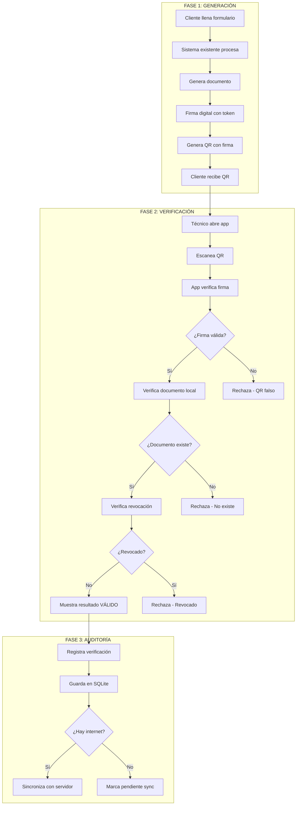

---

## 2. Flujo de Generación de QR

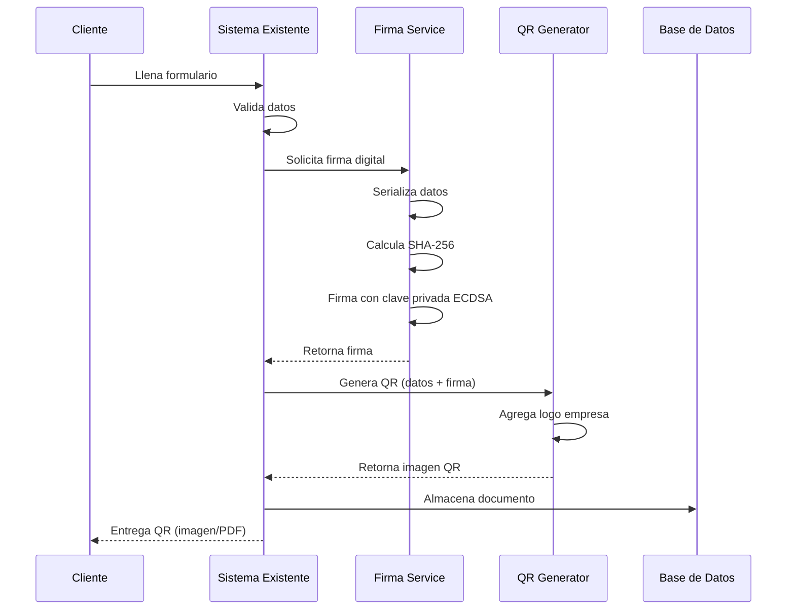

---

## 3. Flujo de Verificación Offline

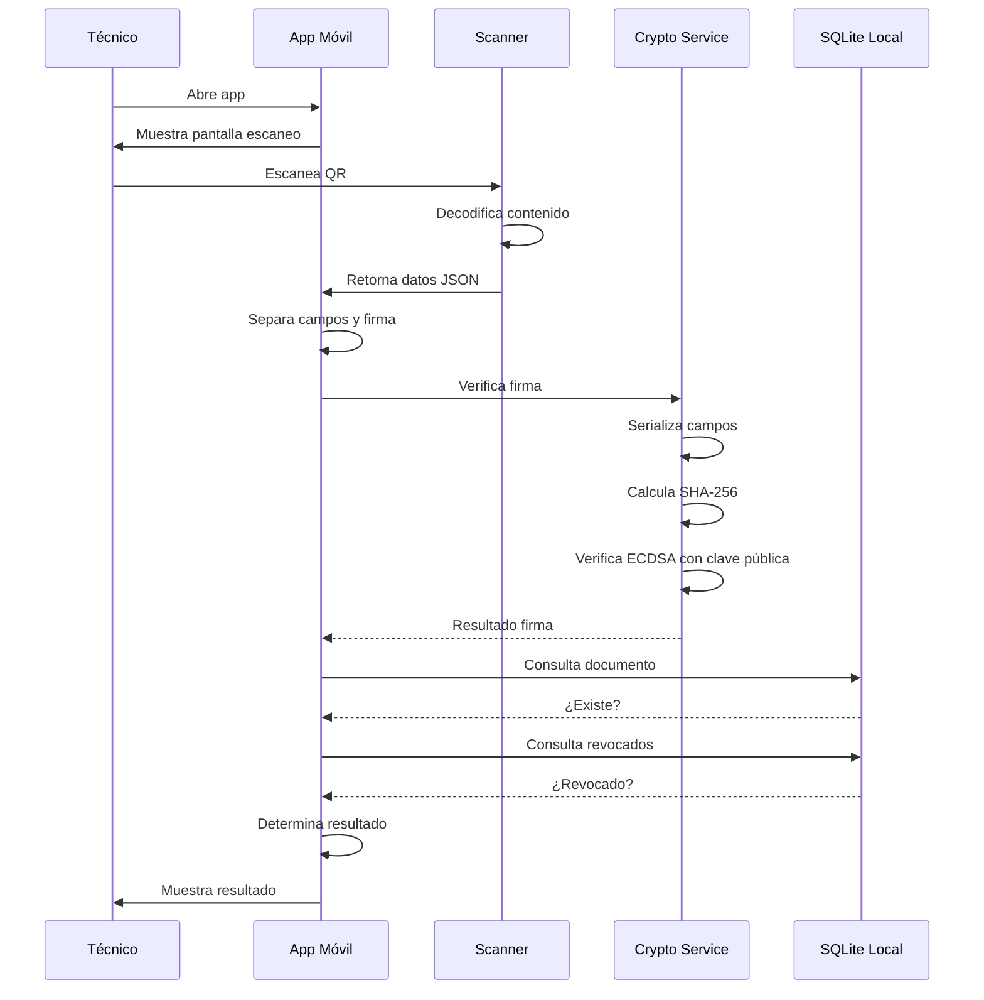

---

## 4. Flujo de Sincronización

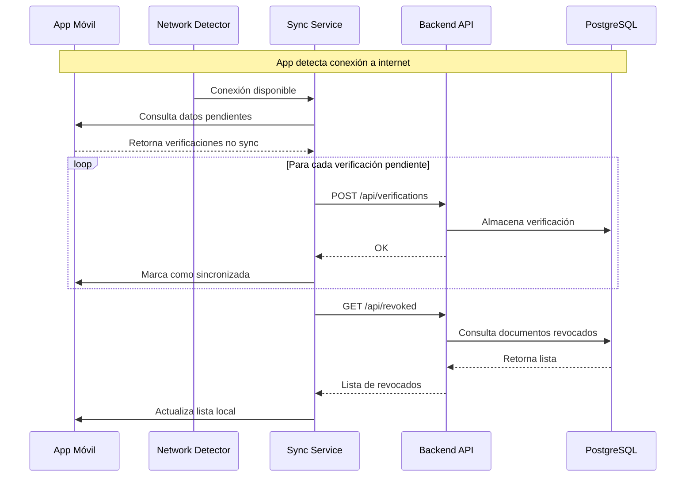

---

## 5. Flujo de Revocación

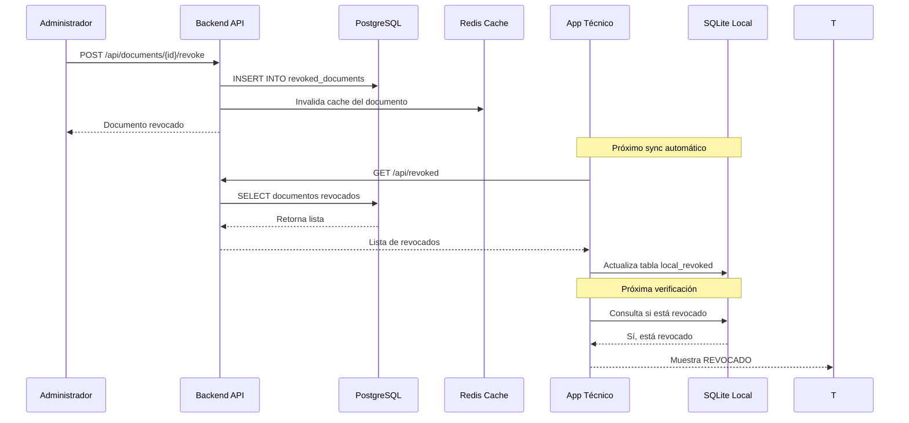

---

## 6. Flujo de Autenticación

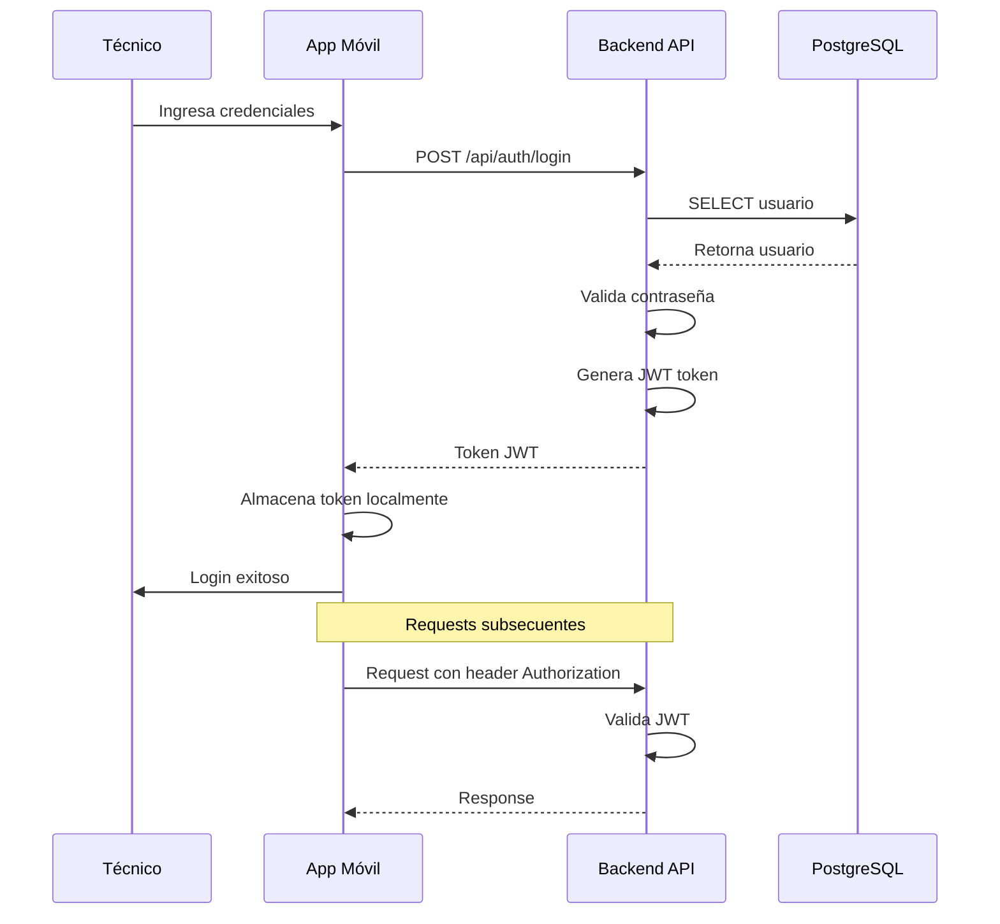

---

## 7. Flujo de Verificación con Internet

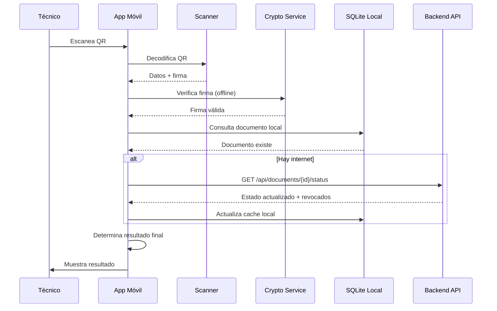

---

## 8. Diagrama de Estados - Documento

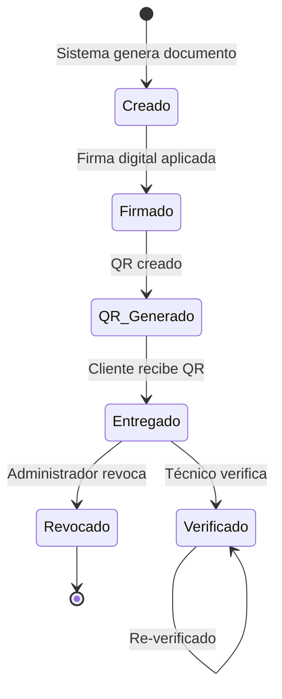

---

## 9. Diagrama de Estados - Verificación

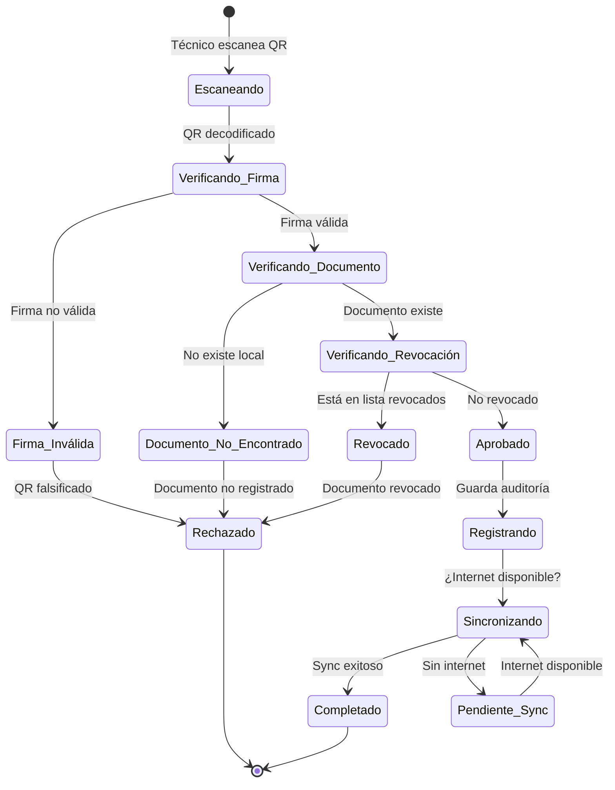

---

## 10. Diagrama de Secuencia - Caso de Uso Principal

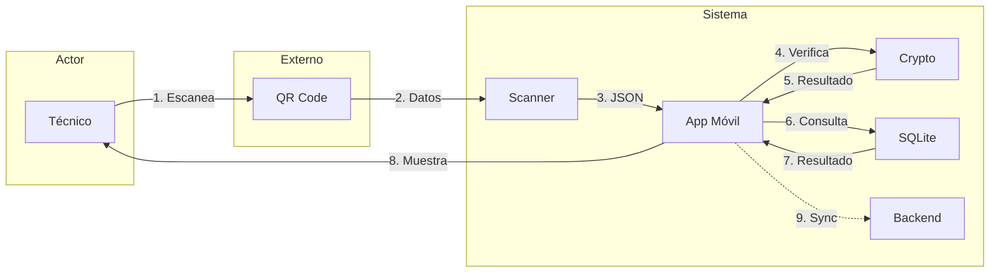

---

## 11. Flujos Alternativos

### 11.1 QR Dañado o No Legible

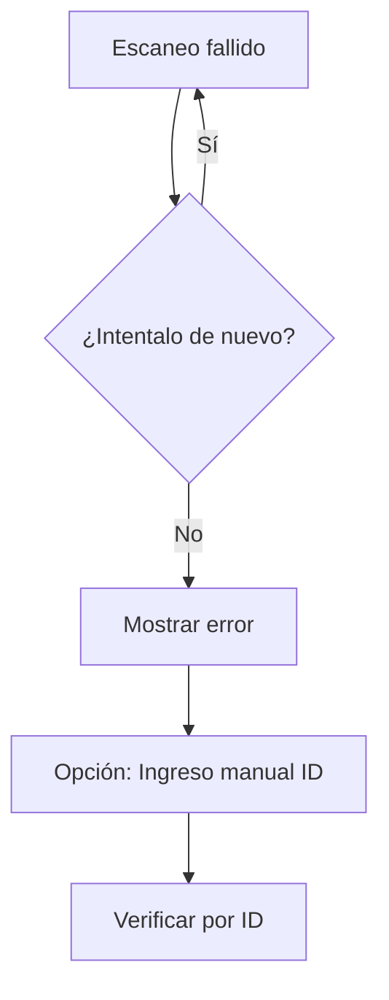

### 11.2 Dispositivo Sin GPS

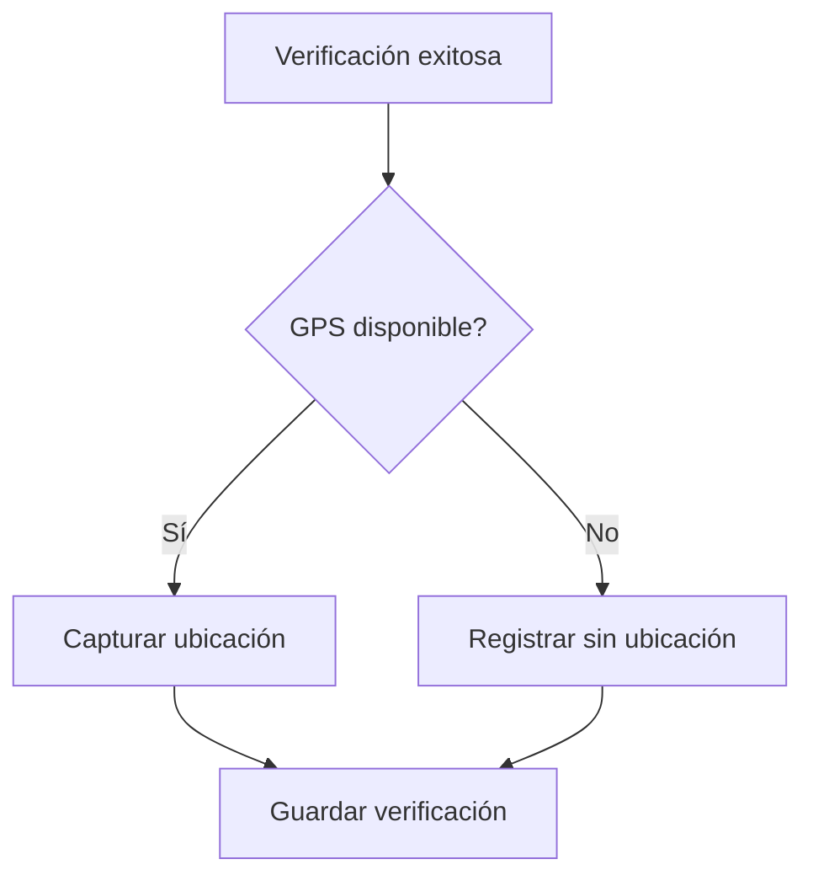

### 11.3 Base de Datos Local Corrupta

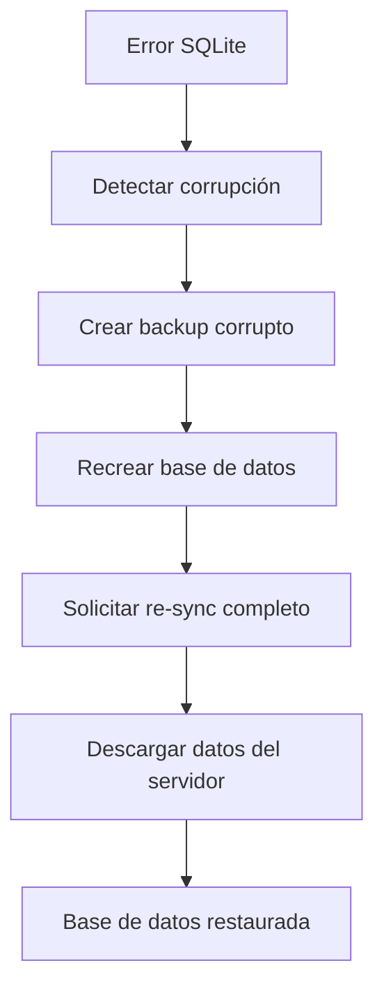

---

## 12. Casos de Uso Detallados

### CU-001: Verificar Documento

| Campo | Descripción |
|-------|-------------|
| **ID** | CU-001 |
| **Nombre** | Verificar Documento |
| **Actor** | Técnico |
| **Precondiciones** | App instalada, técnico autenticado |
| **Postcondiciones** | Verificación registrada |

**Flujo Principal:**
1. Técnico selecciona "Escanear QR"
2. App activa cámara
3. Técnico apunta al QR del cliente
4. App decodifica QR
5. App verifica firma digital
6. App verifica documento en SQLite
7. App verifica lista de revocados
8. App muestra resultado (VÁLIDO/INVÁLIDO/REVOCADO)
9. App muestra campos clave del documento
10. Técnico presiona "Confirmar Verificación"
11. App registra verificación con timestamp y GPS

**Flujos Alternativos:**
- 5a. Firma inválida: App muestra "QR FALSO - Documento no válido"
- 6a. Documento no encontrado: App muestra "Documento no registrado"
- 7a. Documento revocado: App muestra "DOCUMENTO REVOCADO"

### CU-002: Ver Reporte Completo

| Campo | Descripción |
|-------|-------------|
| **ID** | CU-002 |
| **Nombre** | Ver Reporte Completo |
| **Actor** | Técnico |
| **Precondiciones** | Verificación exitosa, conexión a internet |
| **Postcondiciones** | PDF descargado y mostrado |

**Flujo Principal:**
1. Después de verificación exitosa
2. Técnico selecciona "Ver Reporte Completo"
3. App verifica conexión a internet
4. Si hay internet: descarga PDF desde servidor
5. App muestra PDF en visor embebido
6. Técnico puede hacer zoom, scroll
7. Técnico cierra visor

**Flujos Alternativos:**
- 3a. Sin internet: App muestra "Reporte disponible solo con conexión"

### CU-003: Sincronizar Datos

| Campo | Descripción |
|-------|-------------|
| **ID** | CU-003 |
| **Nombre** | Sincronizar Datos |
| **Actor** | Sistema (automático) |
| **Precondiciones** | Conexión a internet disponible |
| **Postcondiciones** | Datos sincronizados |

**Flujo Principal:**
1. App detecta conexión a internet
2. App consulta verificaciones pendientes de sync
3. App envía verificaciones al servidor
4. Servidor almacena verificaciones
5. App descarga lista de revocados actualizada
6. App actualiza SQLite local
7. App marca datos como sincronizados

---

## 13. Matriz de Traceabilidad

| Requisito | Caso de Uso | Componente | API Endpoint |
|-----------|-------------|------------|--------------|
| RF-001 | CU-001 | QR Generator | POST /api/documents |
| RF-010 | CU-001 | QR Scanner | - |
| RF-011 | CU-001 | Crypto Service | - |
| RF-014 | CU-001 | Result Screen | - |
| RF-020 | CU-001 | Audit Service | POST /api/verifications |
| RF-030 | CU-003 | Sync Service | GET /api/sync |
| RF-032 | CU-003 | Revoked Service | GET /api/revoked |

---

*Documento generado para el proyecto Akuma QR Validator*
*Versión 1.0 - Julio 2024*
